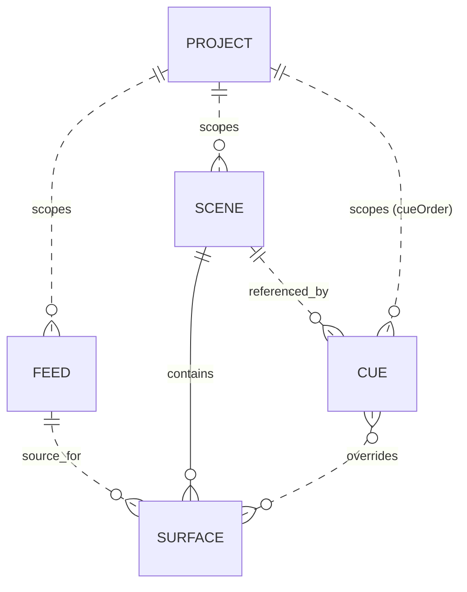

# Lumi Mapper

A modular, open-source **projection/video mapping engine** written primarily in **C++**, designed to run on **Raspberry Pi** and **macOS**.

__Highights__

- Render multiple real-time **video feeds** onto **skewed rectangles/quads/meshes**.
- Control playback and parameters via **MIDI**, **audio input energy**, and **remote clients**.
- Persist **scenes, surfaces, feeds, cues** and configuration in an **embedded SQLite3** database file.
- Use a **client–server model** so the machine connected to the projector can be controlled from other devices.

> Architecture & conventions for agents and humans are documented in [`AGENTS.md`](./AGENTS.md).  
> Regardless if you are a human or a coding agent, if you change anything important in the architecture, update `AGENTS.md` in the same PR.

---

## High-Level Architecture

The project is a C++-centric monorepo with four main components:

- **`/core` – Core Library**
  - Pure C++ domain model and logic.
  - Knows about: Scenes, Surfaces, Feeds, Cues, Layers, Playback state.
  - Provides JSON serialization (via nlohmann::json) and validation helpers for the domain entities.
  - No rendering, DB, or networking dependencies.

- **`/server` – Server**
  - C++ server built on top of the core library.
  - Persists state to **SQLite3 (embedded, file-based)** and manages asset metadata.
  - Exposes a **remote API** over TCP/IP for clients.
  - Talks to the Renderer via a local **control protocol** (JSON over TCP in v0).

- **`/renderer` – Renderer**
  - C++ application using **openFrameworks** (optional `ofxMidi` addon).
  - Runs on the machine that is physically connected to the **projector**.
  - Receives commands from the server and renders scenes in real time.

- **`/clients` – Clients**
  - C++ CLI and/or GUI tools.
  - Talk only to the **server** via its remote API.
  - Used to manage scenes, feeds, surfaces, cues, and playback.

Assets (images, video files, etc.) are stored on the filesystem (e.g. `./data/assets`), while structured state lives in an embedded SQLite3 database file under `./data/db`.

### Core library capabilities

- Domain classes for IDs/enums plus Feed, Surface, Scene, and Cue.
- JSON serialization/deserialization for the main entities and helper types.
- Validation helpers to confirm references between surfaces, feeds, scenes, and cues.

---

## Planned features

- **FFT analysis** to drive visual modulation from audio.
- **LFO modulation** for time-based parameter animation.
- **Optional ofxPiMapper integration** for advanced surface mapping workflows.

---

## Core domain overview

The core library models a few key entities that the server, renderer, and clients share:

- **Project** – show-level container with cue ordering and settings (controllers, MIDI channels, globals).
- **Feed** – a project-scoped source of pixels (video file, camera, generated content) with configuration metadata.
- **Surface** – a quad/mesh within a Scene; references a Feed by id with blend/opacity/brightness controls.
- **Scene** – a project-scoped collection of Surfaces configured together for playback.
- **Cue** – a project-scoped reference to a Scene with optional per-surface opacity/brightness overrides.



Surfaces are embedded within their parent Scene (not stored as top-level entities), and cue ordering lives on Project as `cueOrder`.

---

## Build & runtime prerequisites

- **SQLite3** headers and library on the host (e.g., `libsqlite3-dev` on Debian/Ubuntu or Homebrew `sqlite` on macOS).
- No external database service is required; the server reads/writes a local file-backed DB at `./data/db/projection.db` by default.
- **openFrameworks** (`of_v0.12.1` tested) is required for the renderer; set `OPENFRAMEWORKS_DIR` to the install that contains `libs/openFrameworks/ofMain.h`. MIDI control requires the `ofxMidi` addon in that installation (renderer builds without it but MIDI input is disabled). For Raspberry Pi builds, install the matching openFrameworks Linux ARM release and point `OPENFRAMEWORKS_DIR` at it.

__On MacOSX__ 

On MacOSX may need to install the compiler and sqlite library before compiling.

```bash
brew install cmake # in case you get "command not found: cmake"
brew install sqlite
export LDFLAGS="-L/usr/local/opt/sqlite/lib"
export CPPFLAGS="-I/usr/local/opt/sqlite/include"
```

## Build

### Manual build: server (`lumi_server`)

```bash
# Configure once (re-use the same build dir for repeated builds)
cmake -S . -B build -DCMAKE_BUILD_TYPE=RelWithDebInfo

# Build only the server binary
cmake --build build --target lumi_server
```

- Binary output: `./build/server/lumi_server`

### Manual build: renderer (`renderer_default`)

```bash
# If you already configured `build/` you can skip the first line
cmake -S . -B build -DCMAKE_BUILD_TYPE=RelWithDebInfo -DOPENFRAMEWORKS_DIR=/path/to/of_v0.12.1_osx_release

# Build only the renderer binary
cmake --build build --target renderer_default
```

- Binary output: `./build/renderer/renderer_default`

### Multi-platform builds (macOS x86_64/arm64 + Raspberry Pi native)

Use CMake presets for repeatable configurations:

```bash
# macOS x86_64
export OPENFRAMEWORKS_DIR=/path/to/of_v0.12.1_osx_release
cmake --preset macos-x86_64
cmake --build --preset macos-x86_64 --target renderer_default

# macOS arm64 (M1/M2)
export OPENFRAMEWORKS_DIR=/path/to/of_v0.12.1_osx_release_arm64
cmake --preset macos-arm64
cmake --build --preset macos-arm64 --target renderer_default

# Raspberry Pi native build (run on the Pi)
export OPENFRAMEWORKS_DIR=/path/to/of_v0.12.1_linuxarmv7l_release
export OPENFRAMEWORKS_PLATFORM=linuxarmv7l  # or linuxarm64/linuxarmv6l
cmake --preset rpi-native
cmake --build --preset rpi-native --target renderer_default
```

Notes:
- macOS builds require a matching openFrameworks install for the target architecture.
- For Raspberry Pi, `OPENFRAMEWORKS_PLATFORM` selects `libs/openFrameworksCompiled/lib/<platform>`; override with `OPENFRAMEWORKS_LIB_DIR` if your OF layout differs.
- If additional link libs are needed on Linux, set `OPENFRAMEWORKS_EXTRA_LIBS` to a semicolon-separated list.

### Convenience build script

```bash
./scripts/build_all.sh           # builds lumi_server + renderer_default into ./build
MACOS_ARCH=x86_64 ./scripts/build_all.sh
MACOS_ARCH=arm64 ./scripts/build_all.sh
BUILD_TYPE=Debug ./scripts/build_all.sh
BUILD_DIR=/tmp/pmapper ./scripts/build_all.sh

# Example
OPENFRAMEWORKS_DIR=/Users/aweijnitz/openFrameworks/of_v0.12.1_osx_release ./scripts/build_all.sh
```

- Defaults to `RelWithDebInfo` into `./build`. Additional arguments are passed through to `cmake --build`.
- Set `OPENFRAMEWORKS_DIR` to your openFrameworks installation before configuring/building the renderer.

## Run

- The server uses an embedded **SQLite3** database file and will create the DB on first run if it does not already exist.
- Configuration is provided via command-line flags: `--db <path>` for the SQLite file location and `--port <port>` for the HTTP listener.
- If you pull schema changes, delete the SQLite file to reset state (no automatic migrations yet).

```bash
# Start the server with explicit configuration
./build/server/lumi_server --db ./data/db/projection.db --port 8080
```

### Serve the Composer SPA from the server (optional)

Build the SPA and point the server at the build output to keep the UI and API on the same origin:

```bash
# Build the Composer SPA
cd clients/composer
npm run build

# Serve API + SPA together
./build/server/lumi_server --db ./data/db/projection.db --port 8080 --web-root ./clients/composer/dist
```

Example API calls (HTTP+JSON):

```bash
curl http://localhost:8080/api/renderer/ping

curl -X POST http://localhost:8080/api/projects \
  -H "Content-Type: application/json" \
  -d '{"id":"project-1","name":"Demo Project","description":"","cueOrder":[],"settings":{"controllers":{},"midiChannels":[],"globalConfig":{}}}'

curl -X POST http://localhost:8080/api/projects/project-1/feeds \
  -H "Content-Type: application/json" \
  -d '{"projectId":"project-1","id":"feed-1","name":"Camera","type":"Camera","configJson":"{}"}'

curl http://localhost:8080/api/projects/project-1/feeds

curl -X POST http://localhost:8080/api/projects/project-1/scenes \
  -H "Content-Type: application/json" \
  -d '{"projectId":"project-1","id":"scene-1","name":"Main","description":"Example scene","surfaces":[]}'

curl http://localhost:8080/api/projects/project-1/scenes
```

### Renderer integration

Two long-running processes work together: the **server** (`lumi_server`) and the **renderer** (`renderer_default`).

- **Default ports**: HTTP API on **8080**; renderer connection port on **5050**.
- **Start the server** (listens for renderer connections):

  ```bash
  ./build/server/lumi_server \
    --db ./data/db/projection.db \
    --port 8080 \
    --renderer-port 5050
  ```

- Server parameters:
  - `--db <path>` (default `./data/db/projection.db`).
  - `--port <port>` (default `8080`, HTTP API listener).
  - `--renderer-port <port>` (default `5050`, renderer TCP listener).
  - `--web-root <path>` to serve the Composer SPA (optional).
  - `--verbose` to enable extra logging.

- **Start the renderer** (in a separate terminal, connects to the server):

  ```bash
  ./build/renderer/renderer_default \
    --server-host 127.0.0.1 \
    --server-port 5050 \
    --name renderer-main
  ```

Renderer connection notes:

- The renderer retries server connections (default 10 attempts, 2 seconds apart).
- Connection parameters:
  - `--server-host <host>` (or `RENDERER_HOST`, default `127.0.0.1`).
  - `--server-port <port>` or `--port <port>` (or `RENDERER_PORT`, default `5050`).
  - `--name <name>` (or `RENDERER_NAME`, default `renderer-<pid>`).
- Use `--connect-retries <N>` or `RENDERER_CONNECT_RETRIES` to override.
- Use `--disable-audio` or `--no-audio` (or `RENDERER_DISABLE_AUDIO=1`) to skip audio input setup.
- Use `--verbose` to log connection attempts and handshake status.

Full example (all settings):

```bash
./build/renderer/renderer_default --verbose \
  --server-host 127.0.0.1 \
  --server-port 5050 \
  --name renderer-main \
  --disable-audio \
  --connect-retries 10
```

Example renderer control calls:

```bash
# List connected renderers
curl -X POST http://localhost:8080/api/renderer/ping

# Load a scene that already exists in the server DB
curl -X POST http://localhost:8080/api/projects/project-1/renderer/loadScene \
  -H "Content-Type: application/json" \
  -d '{"sceneId":"1"}'
```

The renderer draws video feeds mapped to surfaces and overlays status text (last command, scene, and errors).

### Example(two videos + MIDI/audio)

Follow this minimal recipe to see the full end-to-end chain (server + renderer + control protocol + MIDI/audio input):

1. **Build both binaries**
   ```bash
   ./scripts/build_all.sh
   ```

2. **Prepare demo assets** – place two small MP4 clips at `./data/assets/clipA.mp4` and `./data/assets/clipB.mp4`.

3. **Start the server** (HTTP API on 8080; listens for renderer connections on 5050):
   ```bash
   ./build/server/lumi_server \
     --db ./data/db/projection.db \
     --port 8080 \
     --renderer-port 5050
   ```

4. **Start the renderer** (connects to the server):
   ```bash
   ./build/renderer/renderer_default \
     --server-host 127.0.0.1 \
     --server-port 5050 \
     --name renderer-main
   ```
   Optional flags:
   - `--verbose` for connection logs.
   - `--connect-retries 10` to retry before exiting.
   - `--disable-audio` if CoreAudio input is unavailable.

5. **Seed feeds and a scene (two ways):**
   - **Manual calls**
     ```bash
     # Create a project to scope all feeds/scenes/cues
     curl -X POST http://localhost:8080/api/projects -H "Content-Type: application/json" \
       -d '{"id":"project-1","name":"Demo Project","description":"","cueOrder":[],"settings":{"controllers":{},"midiChannels":[],"globalConfig":{}}}'

     # Create two VideoFile feeds pointing at the prepared assets
     curl -X POST http://localhost:8080/api/projects/project-1/feeds -H "Content-Type: application/json" \
       -d '{"projectId":"project-1","id":"1","name":"Clip A","type":"VideoFile","configJson":{"filePath":"data/assets/clipA.mp4"}}'
     curl -X POST http://localhost:8080/api/projects/project-1/feeds -H "Content-Type: application/json" \
       -d '{"projectId":"project-1","id":"2","name":"Clip B","type":"VideoFile","configJson":{"filePath":"data/assets/clipB.mp4"}}'

     # Create a scene with two surfaces that reference the feeds and include quad vertices
     curl -X POST http://localhost:8080/api/projects/project-1/scenes -H "Content-Type: application/json" \
       -d '{"projectId":"project-1","id":"1","name":"Two Video Demo","description":"M4 walkthrough","surfaces":[{"id":"surface-a","name":"Left Quad","vertices":[{"x":-0.8,"y":-0.6},{"x":-0.1,"y":-0.5},{"x":-0.1,"y":0.2},{"x":-0.8,"y":0.1}],"feedId":"1","opacity":1.0,"brightness":1.0,"blendMode":"Normal","zOrder":0},{"id":"surface-b","name":"Right Quad","vertices":[{"x":0.1,"y":-0.3},{"x":0.8,"y":-0.2},{"x":0.7,"y":0.5},{"x":0.0,"y":0.4}],"feedId":"2","opacity":1.0,"brightness":1.0,"blendMode":"Normal","zOrder":1}]}'

     # Send the full Scene + Feeds payload to the renderer
     curl -X POST http://localhost:8080/api/projects/project-1/renderer/loadScene -H "Content-Type: application/json" -d '{"sceneId":"1"}'
     ```
     (`configJson` accepts either a JSON string or an inline JSON object; it is stored as a serialized string internally.)

   - **Demo helper endpoint** (auto-creates feeds/surfaces/scene and sends LoadSceneDefinition):
     ```bash
     curl -X POST http://localhost:8080/api/demo/two-video-test -d ''
     ```
     The JSON response includes the created project, feed, and scene IDs.
     Note: cpp-httplib requires a `Content-Length` header for POST; `-d ''` adds an explicit empty body.

     To clear demo projects:
     ```bash
     curl -X POST http://localhost:8080/api/demo/clear-projects -d ''
     ```

6. **Verbose logging (optional)**
   - Server: add `--verbose` to the args (e.g., `SERVER_ARGS="--verbose" ./scripts/server.sh start`).
   - Renderer: start with `--verbose` (e.g., `./scripts/renderer.sh --verbose`).
   - Verbose mode prints request handling, DB actions, renderer sends/receives, and scene load info.

### Quick renderer window sanity check

Run a minimal foreground app that opens a window and draws text (useful to confirm the renderer can show a window before testing video). Requires a local openFrameworks install; configure CMake with it:

```bash
cmake -S . -B build -DOPENFRAMEWORKS_DIR=/path/to/of_v0.12.1_osx_release
cmake --build build --target renderer_hello
```

```bash
./build/renderer/renderer_hello --verbose --message "Hello world" --quit-after 5
```

Omit `--quit-after` to leave the window open and close it manually. The app supports `--message "<text>"` and `--verbose`.

Note: `./scripts/build_all.sh` requires `OPENFRAMEWORKS_DIR` to be set.

7. **Observe on the projector/render window:**
   - Two separate videos should appear, each pinned to its own quad.
   - Turning MIDI CC #1 (a knob) modulates brightness.
   - Playing audio into the renderer’s input modulates the scale via input energy.
